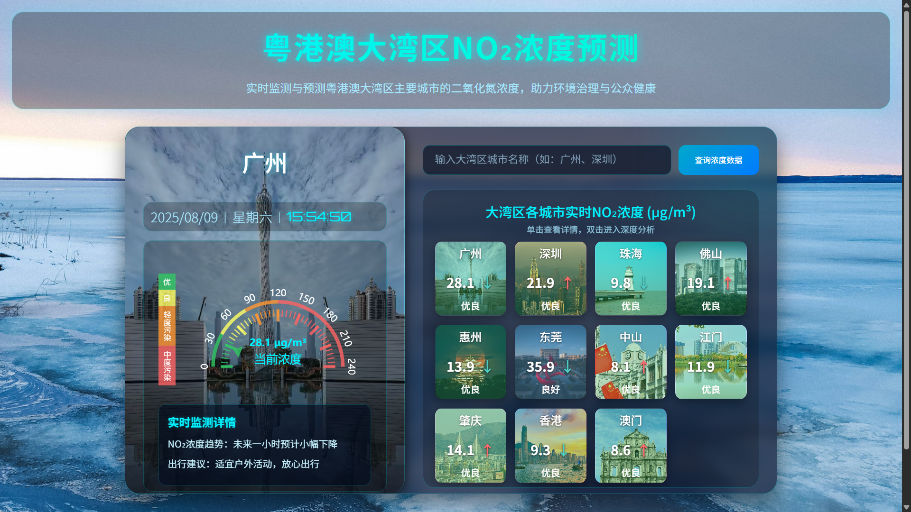
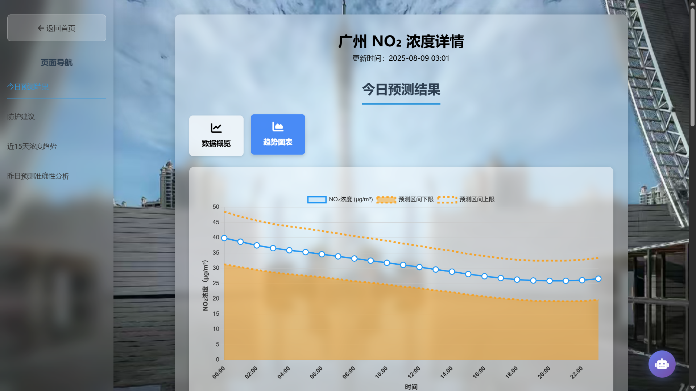
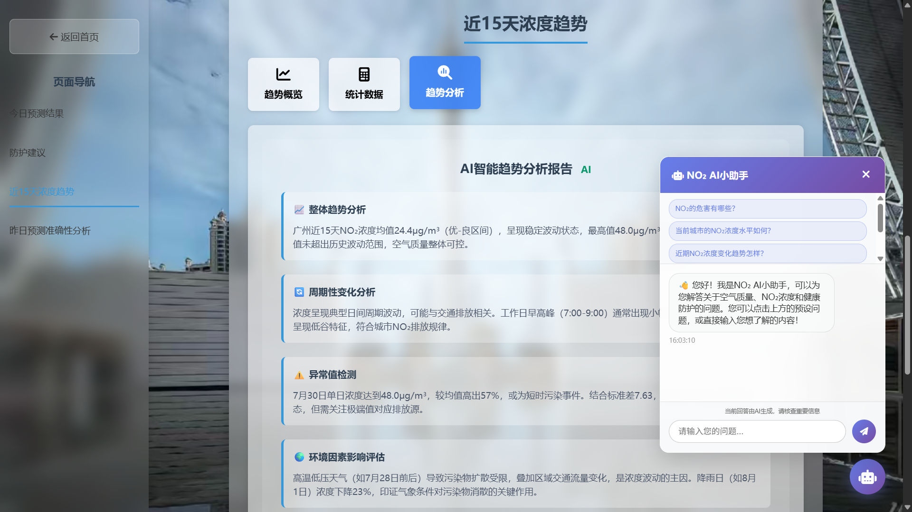

# 基于机器学习大湾区的 NO₂ 浓度预测与可视化系统

## 1. 项目概述

- **核心目标**：预测大湾区主要城市及地区未来 24 小时的大气 NO₂ 浓度，展示变化折线图及预测区间。
- **使用方法**：
	- 你可以通过本地部署（参考[使用方法](#4-使用方法)），然后用浏览器访问 http://127.0.0.1:5000 使用系统；或者直接在浏览器输入 http://8.136.12.26/ ，使用云端部署的系统。
	- 进入系统主页，你会看到如下页面。双击任一个城市即可跳转至该城市子页面。你同样也可以在上方的搜索框查询。
	- 进入城市子页面（下图以广州为例），涵盖了今日预测结果、防护建议、近 15 天浓度趋势、昨日预测准确性分析四个板块内容。页面左侧提供导航栏供用户快速切换查看。
    	- 今日预测结果包括数据概览、趋势图表；
    	- 防护建议包括出行、居家、户外、运动、特殊人群有关的多方面建议；
    	- 近 15 天趋势包括趋势概览、统计数据、趋势分析；
    	- 昨日预测准确性分析包括准确性指标、对比图表。
  	- 除此之外，近 15 天浓度趋势中的的趋势分析报告由 AI 大模型生成，你可以通过点击刷新分析获取最新分析。点击右下角的 AI 小助手也可以随时咨询城市 NO₂ 相关信息。

## 2. 项目结构

```bash
no2-prediction-system/
├── config/                     # 配置（环境变量、数据库、路径等）
│   ├── __init__.py
│   ├── cities.py               # 城市配置和映射
│   ├── database.py             # 数据库连接配置
│   ├── paths.py                # 路径常量定义
│   ├── schedule_config.py      # 数据库更新相关参数配置
│   └── settings.py             # 系统设置
│
├── database/                   # 数据库相关
│   ├── __init__.py
│   ├── crud.py                 # 增删改查操作
│   ├── models.py               # ORM模型定义
│   └── session.py              # 会话管理
│
├── data/                       # 数据目录
│   ├── ml_cache/               # 机器学习缓存文件
│   │   ├── features/           # 特征工程缓存
│   │   └── scalers/            # 数据标准化器（按城市分离）
│   └── backup/                 # 数据库备份文件
│
├── ml/                         # 机器学习模块
│   ├── __init__.py
│   ├── models/                 # 模型存储（版本控制）
│   │   ├── __init__.py
│   │   ├── daily/              # 按日期版本的模型
│   │   └── latest/             # 最新模型链接
│   └── src/                    # 核心算法实现
│       ├── __init__.py
│       ├── control.py          # NC-CQR控制脚本
│       ├── data_loader.py      # 数据加载器
│       ├── data_processing.py  # 数据预处理
│       ├── evaluate.py         # 模型评估
│       ├── predict.py          # 预测模块
│       └── train.py            # 模型训练
│
├── outputs/                    # 输出文件目录
│   ├── ml_cache/               # 控制脚本专用缓存
│   │   ├── features/
│   │   └── scalers/
│   ├── models/                 # 控制脚本模型输出
│   │   └── __init__.py
│   └── predictions/            # 预测结果输出（包含csv表格预测数据和png折线图）
│
├── api/                        # API相关
│   ├── __init__.py
│   ├── heweather/              # 和风天气API集成
│   │   ├── __init__.py
│   │   ├── client.py           # API客户端（JWT认证）
│   │   └── data_parser.py      # 数据解析器
│   └── schedules/              # 定时任务
│       ├── __init__.py
│       └── data_collector.py   # 定时数据采集
│
├── web/                        # Web应用
│   ├── __init__.py
│   ├── app.py                  # Flask应用入口
│   ├── routes/                 # 路由定义
│   │   ├── __init__.py
│   │   ├── api_routes.py       # API接口路由
│   │   └── main_routes.py      # 主页面路由
│   ├── static/                 # 静态资源
│   │   ├── images/             # 城市背景图片
│   │   └── js/                 # JavaScript相关类型定义
│   └── templates/              # HTML模板
│       ├── city.html           # 城市详情页
│       └── index.html          # 主页模板
│
├── scripts/                    # 执行脚本
│   ├── auto_training.py        # 调用模型训练管道
│   ├── run_data_collector.py   # 数据采集脚本
│   ├── run_databackup.py       # 数据备份脚本
│   └── setup_database.py       # 数据库初始化
│
├── utils/                      # 工具函数
│   ├── __init__.py
│   └── auth.py                 # 认证相关工具
│
├── .env.example                # 环境变量模板（API密钥、数据库等）
├── ed25519-private.pem         # 和风天气API私钥
├── ed25519-public.pem          # 和风天气API公钥
├── requirements.txt            # Python依赖
└── README.md                   # 项目说明文档
```

## 3. 实现说明

### **API数据采集模块**

- [`api/heweather/client.py`](api/heweather/client.py)定义获取城市ID和历史十天天气及空气质量数据的 API 客户端，支持 JWT 认证，密钥等配置在`.env`。
- **数据入库**：采集到的数据通过[`database/crud.py`](database/crud.py)写入数据库，结构定义见[`database/models.py`](database/models.py)，支持 11 个城市的分表存储。
- **数据采集**：[`api/schedules/data_collector.py`](api/schedules/data_collector.py)采集过去十天的历史数据，支持防重复插入机制。

### 模型训练模块

- **数据加载模块**：[`ml/src/data_loader.py`](ml/src/data_loader.py)负责从数据库加载数据，获取 30 天固定滑窗（720 小时）的历史数据用于模型训练。
- **特征工程与标准化模块**：[`ml/src/data_processing.py`](ml/src/data_processing.py)负责数据清洗、特征提取和标准化，标准化器按城市分离缓存于[`data/ml_cache/scalers/`](data/ml_cache/scalers/)。
- **训练模块**：[`train.py`](ml/src/train.py)NC-CQR 模型的核心算法，包括设置惩罚项保证上下分位数非交叉，提供统计有效的预测区间，理论上保证90%的覆盖率。提供模型存储功能，方便后续预测时快速调用。
- **预测模块**：[`predict.py`](ml/src/predict.py)基于训练好的模型预测未来 24 小时 NO₂ 浓度变化，可存储预测结果为 CSV 表格和 PNG 格式折线图。
- **可重现保证**：[`ml\src\reproducibility.py`](ml\src\reproducibility.py)通过生成多个城市的随机种子、创建可重现性上下文管理器等方式，控制算法的随机性。
- **模型训练**：包括训练管道和控制脚本两种训练方式。
    - **训练管道**：[`scripts/run_pipeline.py`](scripts/run_pipeline.py)提供批量训练和版本控制，用于部署至 NO₂ 预测系统的生产环境。
    - **控制脚本**：[`ml/src/control.py`](ml/src/control.py)提供独立于生产环境的训练、预测、评估功能，用于模型性能调试。

> [!NOTE]
> 控制脚本的详细使用方法见[其他说明](#5-其他说明)。

- **模型存储方式**：上述两种方式训练的模型会以`.pth`格式分开存储。
    - **训练管道模型**：存储在`ml/models/daily/`（按日期版本）和`ml/models/latest/`（最新版本链接）。
    - **控制脚本模型**：存储在`outputs/models/`。

### Flask Web 应用

- [`web/app.py`](web/app.py)为 Flask 入口程序。
- [`web/routes/main_routes.py`](web/routes/main_routes.py)定义主路由，负责构建起主要 Web 页面。
- [`web/routes/api_routes.py`](web/routes/api_routes.py): API 端点，主要提供 NO₂ 浓度预测相关的 HTTP 接口，包括历史数据查询、预测接口、城市列表查询等功能。
- [`web/templates/`](web/templates/)存储 HTML 模板、背景图片等静态资源。

## 4. 使用方法

1. **安装依赖**
   ```bash
   pip install -r requirements.txt
   ```

2. **配置环境变量**
	- 复制`.env.example`文件为`.env`，存至项目根目录。
	- 在`.env`中填写您的和风天气 API 密钥、数据库连接、硅基流动 API（可选，用于启用大模型问答功能）。

> [!NOTE]
> ed25519 密钥生成以及使用方式详情见和风天气官方文档[身份认证](https://dev.qweather.com/docs/configuration/authentication/)。

3. 启动 MySQL 服务
	```bash
	net start <your-service-name>
	```

4. **初始化数据库**
	```bash
	python -m scripts.setup_database
	```

> [!WARNING]
> 此操作会清除数据库中所有数据表以重新创建，你的数据库中的所有数据会被清除，若你的数据库中已经存有历史的 NO₂ 数据，建议在执行此操作前先对原数据进行备份。备份操作参见[其他说明](#5-其他说明)。

5. **采集历史数据**
	```bash
	python -m scripts.run_data_collector
	```

6. **训练模型**
	```bash
	python -m scripts.auto_training run
	```

7. **启动 Web 系统**

	- **后端服务启动**
	
	  执行以下命令启动后端服务：
	  ```bash
	  python -m web.app
	  ```
	  成功启动后，终端将输出类似以下信息：
	  ```bash
	  * Serving Flask app 'app'
	  * Debug mode: on
	  * Running on http://127.0.0.1:5000
	  Press CTRL+C to quit
	  * Restarting with stat
	  * Debugger is active!
	  * Debugger PIN: 274-107-827
	  ```
	  上述输出表明：Flask 应用已在本地 5000 端口成功启动，处于开发模式。
	  可通过访问 http://127.0.0.1:5000 查看预测结果和可视化图表。

	- **访问方式**

	  打开浏览器访问 http://127.0.0.1:5000 即可使用系统，操作流程如下：
		- 在搜索框输入城市名（如"广州"、"深圳"），从下拉列表选择目标城市
		- 系统将自动加载并展示该城市未来 24 小时的 NO₂ 浓度预测结果
		- 图表中包含预测值曲线和 95% 置信区间

	- **Web 系统功能说明**

		- 城市搜索：支持模糊查询，快速定位大湾区城市
		- 数据可视化：通过折线图直观展示 NO₂ 浓度预测趋势
		- 预测详情：显示未来 24 小时每小时的预测值及置信区间
		- 城市切换：可通过搜索框快速切换不同城市查看预测结果

## 5. 其他说明

- **数据备份**：备份数据到[`data/backup`](data/backup)
	```bash
	python -m scripts.run_databackup         # 备份数据库数据到CSV文件
	```
- **模型手动训练**：进入项目根目录运行 NC-CQR 算法控制脚本，可调整训练轮次、批次大小、学习率等参数，对模型训练过程进行精细化调整。
	```bash
	python -m ml.src.control -h            # 查看脚本使用帮助
	```
  运行模式: train(训练), predict(预测), evaluate(评估)

  | 选项                            | 说明                              |
  |-------------------------------|---------------------------------|
  | -h, --help                    | show this help message and exit |
  | --city CITY                   | 城市名称 (默认: dongguan)             |
  | --steps STEPS                 | 预测步数(小时) (默认: 24)               |
  | --epochs EPOCHS               | 训练轮数 (默认: 150)                  |
  | --batch-size BATCH_SIZE       | 批次大小 (默认: 32)                   |
  | --learning-rate LEARNING_RATE | 学习率 (默认: 1e-3)                  |
  | --save-chart                  | 保存预测图表                          |
  | --list-cities                 | 列出支持的城市                         |

  使用举例：
	```bash
	python -m ml.src.control train --city dongguan          # 用东莞城市的历史NO₂浓度训练模型
	```
- **模型与数据缓存**：
	- **训练管道**：模型存储在`ml/models/daily/`（按日期版本）和`ml/models/latest/`（最新版本），标准化器缓存于`data/ml_cache/scalers/`
	- **控制脚本**：模型存储在`outputs/models/`，专用缓存在`outputs/ml_cache/`，预测结果保存在`outputs/predictions/`
	- **数据备份**：数据库备份自动保存在[`data/backup`](data/backup)目录，按城市分离

> [!NOTE]
> 上述目录会在执行脚本后自动创建，不会被版本追踪。

- **可扩展性**：支持添加新城市、切换模型、调整预测区间等。

## 6. 额外计划
- 云端部署
- 接入大语言模型打造 NO₂ 预测智能体
- 近 15 天浓度变化趋势分析
